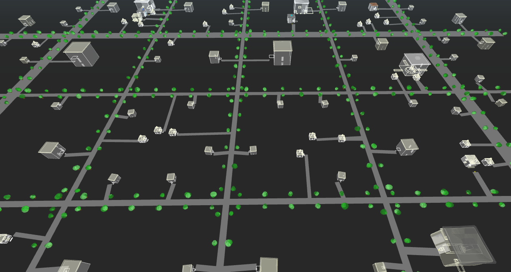
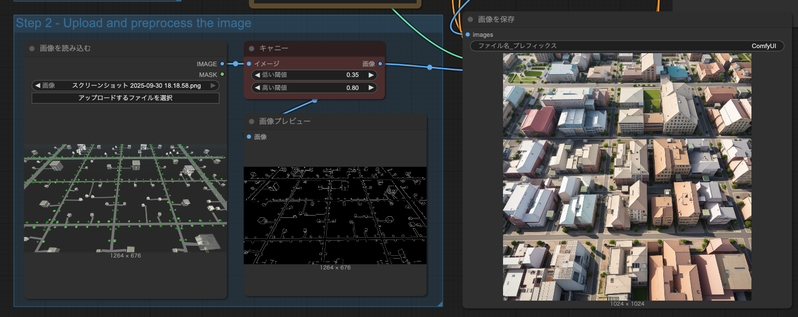
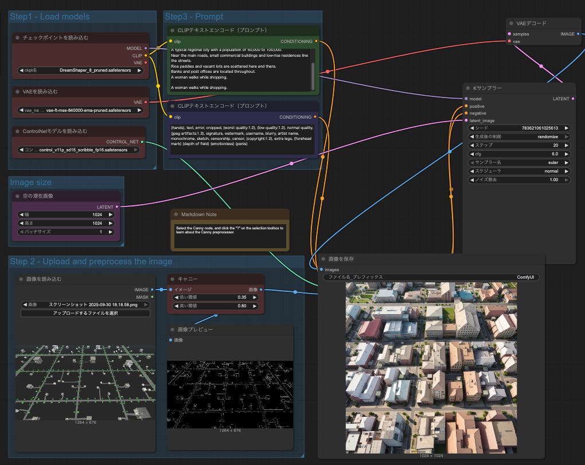
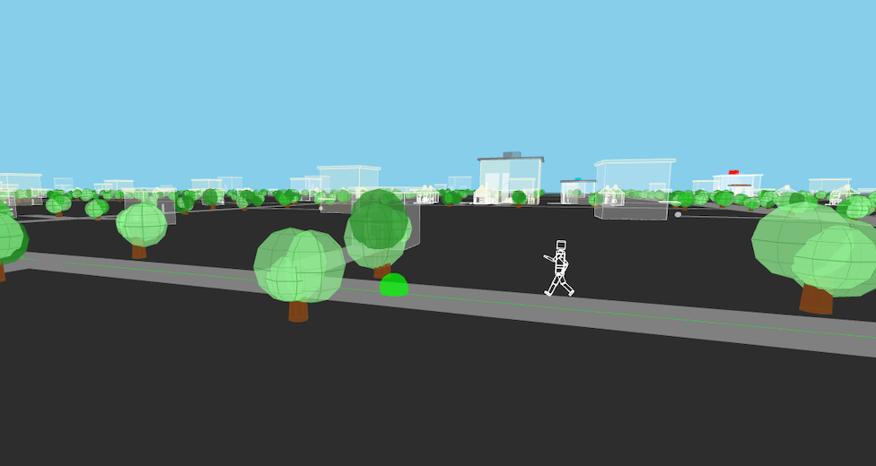
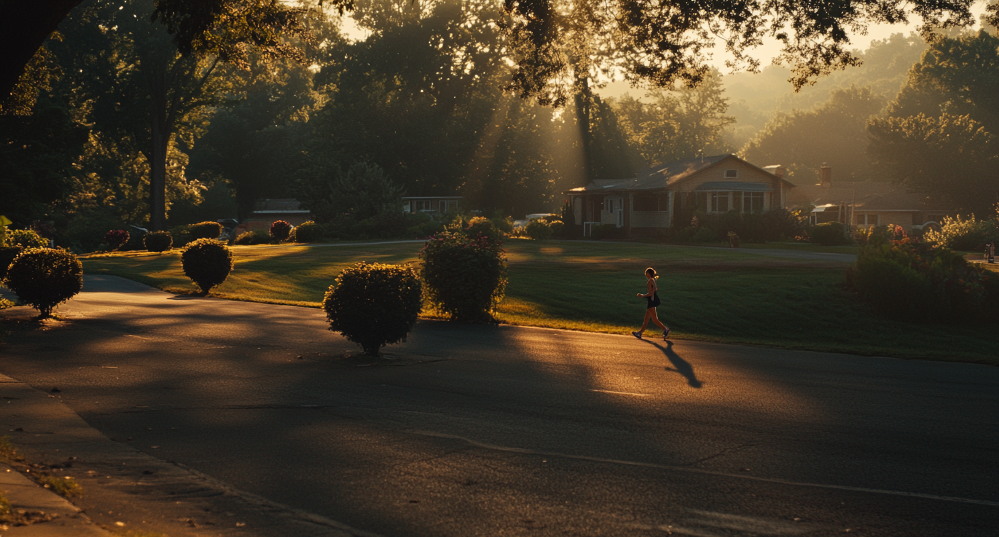

# 都市モデルから動画生成の詳細仕組み

## システム全体構成

都市シミュレーションシステムから生成される3Dモデルデータを、ComfyUIベースの動画生成パイプラインに変換する統合的なワークフローです。

## 1. 都市モデルの前処理段階

### 1.1 3D都市データの抽出
- 都市シミュレーションシステムから、建物配置、道路網、地形データなどの3D幾何情報を取得
- レンダリングエンジン（Blender、Unity、Unreal Engineなど）を使用して、指定されたカメラアングルから都市の2Dイメージをレンダリング
- 複数視点やカメラパス（移動軌跡）を設定することで、動画用の連続フレームを生成




### 1.2 エッジ検出処理
- レンダリングされた都市イメージに対して、**Canny Edge Detection**アルゴリズムを適用
- これにより、建物の輪郭、窓の配置、道路の境界線などの構造情報を抽出
- Cannyで生成されたエッジマップは、ComfyUIのControlNetの入力として使用され、生成される動画の空間的整合性を保証

## 2. ComfyUIによる動画生成パイプライン

### 2.1 ControlNet統合

**ControlNet（Canny方式）の役割：**
- Cannyエッジマップを条件付け入力として使用
- Stable DiffusionやVideo Diffusionモデルの生成プロセスを、都市の構造に忠実にガイド
- 建物の形状、道路のレイアウト、全体的な都市計画が元のシミュレーションデータと一致するように制御

**処理フロー：**
```
都市3Dモデル → レンダリング → Cannyエッジ抽出 → ControlNet入力
                                                    ↓
テキストプロンプト ────────────────────────→ Video Diffusion Model
                                                    ↓
                                            生成動画フレーム
```




### 2.2 テキストプロンプトによる詳細制御

**プロンプト構造の例：**

**[都市の全体的特徴]**
- 時代設定：「近未来都市、2080年代」
- 気候・天候：「夕暮れ時、オレンジ色の空、軽い霧」
- 建築スタイル：「ガラスと鋼のモダン高層ビル、ネオンサイン」

**[環境の詳細]**
- 交通：「空飛ぶ車が行き交う、地上にはハイパーループ駅」
- 植生：「縦型緑化ビル、屋上庭園、街路樹のある歩道」
- 照明：「暖色系のストリートライト、ビルの窓からの光」

**[雰囲気・ムード]**
- 「賑やかで活気のある、サイバーパンク風、少し憂鬱な雰囲気」

これらのテキスト情報により、Cannyエッジだけでは表現できない質感、色彩、雰囲気、時間帯などの視覚的ニュアンスを付加します。





### 2.3 マルチモーダル条件付け

ComfyUIでは、以下の複数の条件を同時に使用可能：
- **ControlNet（Canny）**: 空間構造の制約
- **テキストプロンプト**: 意味的・視覚的詳細
- **Depth Map**: 追加の奥行き情報（オプション）
- **Color Palette**: 色調の統一（オプション）

## 3. アバター・登場人物の統合

### 3.1 ペルソナ定義プロンプト

キャラクターの詳細をテキストで記述：

**[基本情報]**
- 年齢：28歳、性別：女性
- 職業：都市プランナー
- 服装：スマートスーツ、ARグラス装着

**[外見的特徴]**
- 身長：170cm、体型：スリム
- 髪：黒髪ショート、瞳：ダークブラウン
- 特徴：左頬に小さなほくろ

**[性格・行動パターン]**
- 知的で冷静、時折微笑む
- 歩き方：自信に満ちた歩調
- ジェスチャー：考える時に顎に手を当てる癖

### 3.2 リファレンス画像による詳細制御

**複数のリファレンス画像タイプ：**

#### 1. 顔リファレンス（Face Reference）
- キャラクターの顔の特徴を固定
- 複数角度からの顔画像（正面、側面、斜め）
- 表情バリエーション（笑顔、真剣、驚き）

#### 2. ポーズリファレンス（Pose Reference）
- OpenPoseやDWPoseなどの骨格検出ツールで抽出した姿勢情報
- 歩行サイクル、手の動き、体の向きを制御

#### 3. 服装リファレンス（Clothing Reference）
- 衣服のデザイン、色、質感を統一
- 複数の服装画像から特徴を抽出

#### 4. スタイルリファレンス（Style Reference）
- 全体的な画風、照明スタイル、レンダリング品質を統一

**ComfyUIでの実装方法：**
- **IPAdapter**: 画像エンコーダーを使用してリファレンス画像の特徴を抽出し、生成プロセスに注入
- **FaceID**: 顔の一貫性を保つための専用モデル
- **Multi-ControlNet**: 複数のControlNet（Canny + OpenPose + Depth）を同時使用

### 3.3 時間的一貫性の確保

**AnimateDiffやSVDなどの時系列モデル：**
- 連続フレーム間でキャラクターの外見を一貫させる
- 動きの滑らかさを確保（ブレ、チラつきを防止）
- テンポラルアテンション機構により、前後フレームの情報を参照

**動画生成の具体的パラメータ：**
- フレームレート: 24fps
- 解像度: 1920×1080 (Full HD) または 3840×2160 (4K)
- 動画長: 30秒〜5分
- バッチ処理: 16フレームずつ生成し、後で結合
- ガイダンススケール: 7.5（プロンプト忠実度）
- ステップ数: 50（品質とスピードのバランス）

## 4. レンダリング最適化とポストプロセス

### 4.1 レンダリング効率化
- **Latent Space処理**: 低解像度のLatent空間で生成し、VAEでアップスケール
- **バッチ処理**: 複数フレームを並列処理
- **GPU最適化**: mixed precisionやFlashAttentionの活用

### 4.2 ポストプロセス
- **Temporal Smoothing**: フレーム間の不連続性を平滑化
- **Super Resolution**: ESRGAN、Real-ESRGANなどで解像度向上
- **Color Grading**: 最終的な色調整（LUT適用）
- **モーションブラー**: 自然な動きの表現
- **音声合成**: TTS（Text-to-Speech）でナレーションやキャラクターの声を追加

## 5. ワークフロー統合例

```
[入力] 都市シミュレーション3Dモデル
   ↓
[処理1] カメラパス設定 → 連続レンダリング
   ↓
[処理2] Cannyエッジ抽出 → ControlNet用データ
   ↓
[処理3] テキストプロンプト生成（都市詳細、ペルソナ）
   ↓
[処理4] リファレンス画像準備（顔、ポーズ、服装）
   ↓
[ComfyUI処理]
   - Video Diffusion Model
   - Multi-ControlNet (Canny + OpenPose + Depth)
   - IPAdapter (顔・スタイル統一)
   - AnimateDiff (時間的一貫性)
   ↓
[出力] 連続フレーム生成
   ↓
[ポストプロセス] 平滑化、アップスケール、色調整
   ↓
[最終出力] 完成動画 (MP4, ProRes等)
```

## 6. 技術的課題と解決策

### 6.1 一貫性の維持

**課題**: 長時間動画での外見・スタイルのドリフト

**解決策**: 
- IPAdapterでリファレンス画像を定期的に再注入
- KeyframeによるLoRA（Low-Rank Adaptation）の動的調整

### 6.2 計算コスト

**課題**: 高解像度・長時間動画の生成時間

**解決策**:
- Hierarchical生成（低解像度→高解像度）
- Frame Interpolation（少ないキーフレーム生成後に補間）

### 6.3 物理的整合性

**課題**: 重力、衝突、動きの不自然さ

**解決策**:
- 物理シミュレーションと組み合わせたハイブリッドアプローチ
- ControlNetに物理制約を追加

## まとめ

この統合システムにより、都市シミュレーションの構造的正確性と、AIによる豊かな視覚表現を両立させた高品質な動画生成が可能になります。
