# MESA (Multi-Entity Simulation Architecture) - 詳細マニュアル

MESAは、複数のAIエージェントによるシミュレーションを視覚的に作成・観察できるプラットフォームです。このマニュアルでは、基本的な使い方から動画生成まで、ステップバイステップで解説します。

----

## 基本的な使い方の流れ

### 1. APIキーの設定

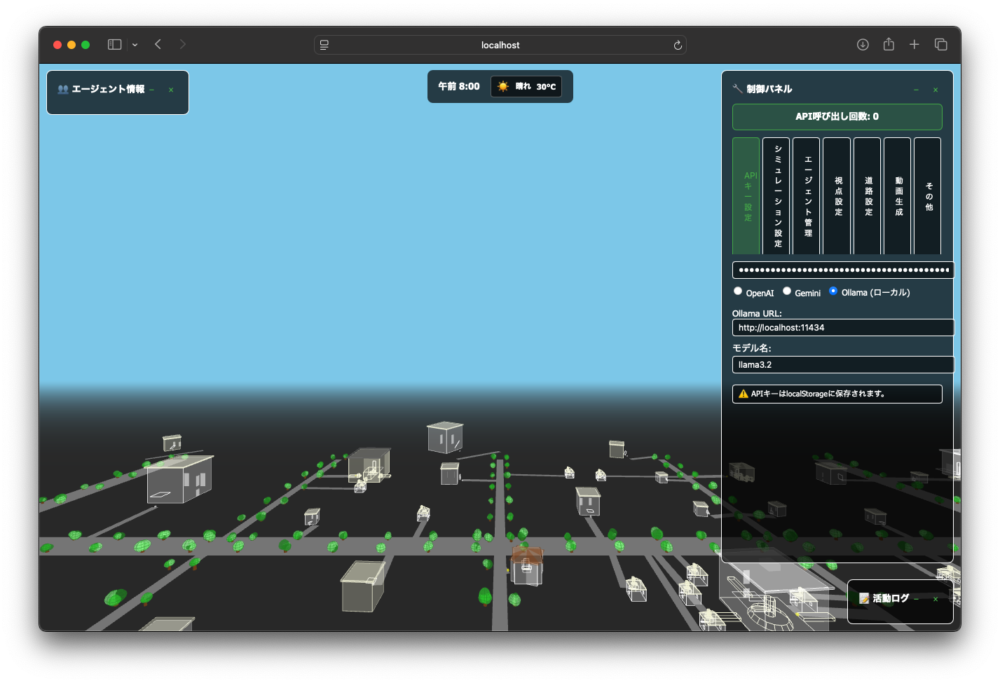

**目的:** MESAでAIエージェントを動かすために必要なAPIキーを設定します。

**手順:**
1. 画面上部または設定メニューから「APIキー設定」を選択
2. お使いのAIサービス(Claude、OpenAIなど)のAPIキーを入力
3. 「保存」ボタンをクリックして設定を完了

**ポイント:**
- APIキーは各AIサービスの公式サイトから取得できます
- キーは安全に管理され、外部に漏洩しないよう注意してください
- 初回起動時には必ずこの設定が必要です

---

### 2. エージェントの作成/読み込み

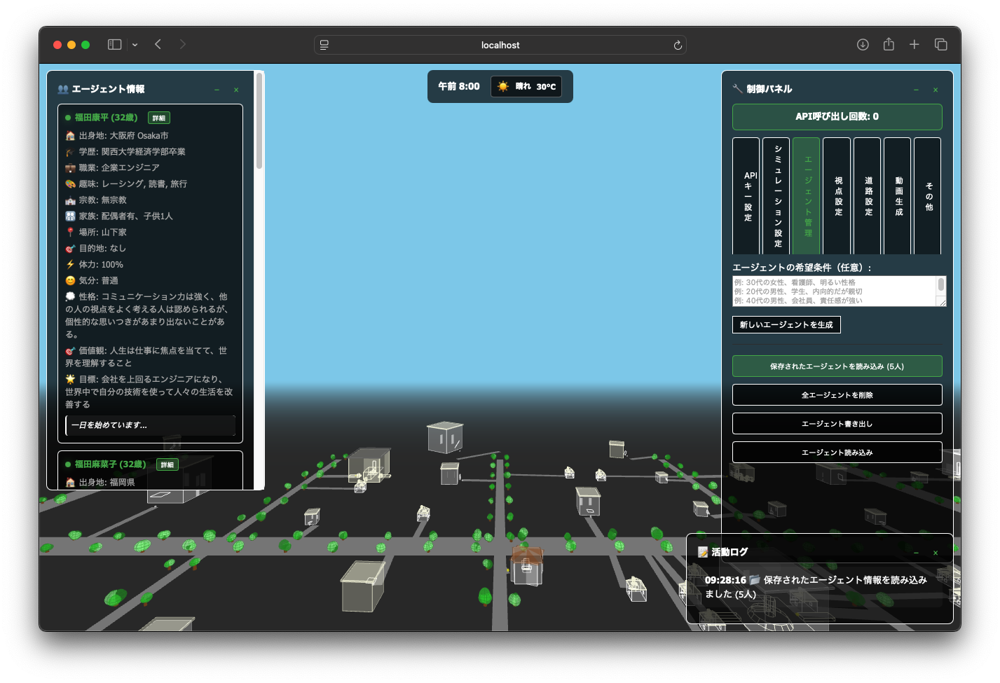

**目的:** シミュレーションに登場するAIエージェント(キャラクター)を作成または既存のエージェントを読み込みます。

**手順:**

**新規作成の場合:**
1. 「新規エージェント作成」ボタンをクリック
2. エージェントの基本情報を入力:
   - 名前(例:「田中太郎」)
   - 性別
   - 年齢
   - 性格や行動特性
   - 初期位置
3. 「作成」ボタンで確定

**既存エージェントの読み込み:**
1. 「エージェント読み込み」ボタンをクリック
2. 保存済みのエージェントファイルを選択
3. 「読み込み」で完了

**ポイント:**
- 複数のエージェントを同時に作成できます
- エージェントの性格設定が行動パターンに影響します
- 作成したエージェントは保存して再利用可能です

---

### 3. シミュレーション開始

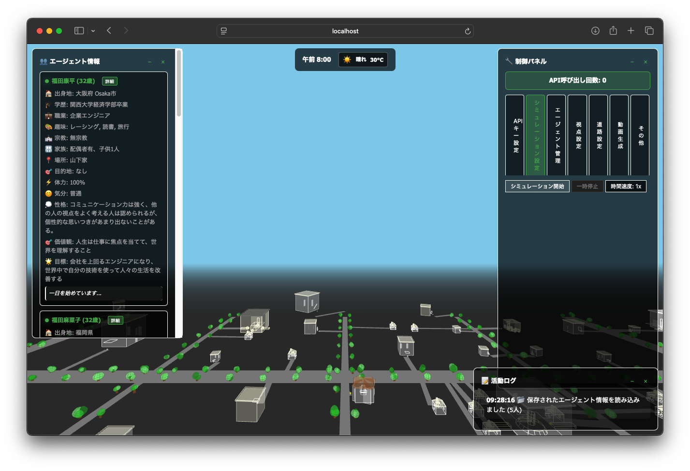

**目的:** 設定したエージェントを使ってシミュレーションを実行します。

**手順:**
1. エージェントが正しく配置されているか確認
2. シミュレーション環境(マップ、時間設定など)を調整
3. 「シミュレーション開始」ボタンをクリック
4. エージェントが自律的に行動を開始します

**シミュレーション中にできること:**
- リアルタイムでエージェントの行動を観察
- 一時停止/再開
- 速度調整(早送り/スロー再生)
- エージェント間の会話や思考ログの確認

**ポイント:**
- シミュレーションは自動的に進行しますが、いつでも介入可能です
- エージェント同士が出会うと、自然な対話や相互作用が発生します

---

### 4. 視点変更で行動観察

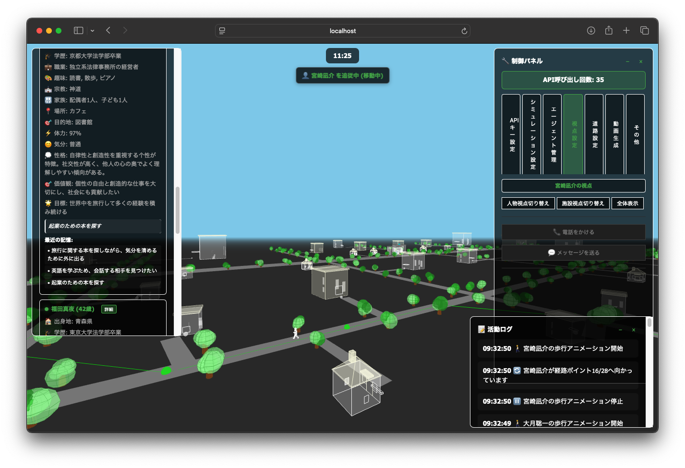

**目的:** さまざまな視点からエージェントの行動を詳しく観察します。

**視点モード:**

**フリーカメラモード:**
- マウスドラッグで自由に視点を移動
- 全体の流れを俯瞰するのに最適

**追跡カメラモード:**
- 特定のエージェントを自動追跡
- 個別の行動を詳しく観察できます

**固定カメラモード:**
- 特定の場所から観察
- 特定エリアでの出来事を記録するのに便利

**操作方法:**
- マウスホイール:ズームイン/アウト
- 右クリック+ドラッグ:カメラ回転
- 左クリック+ドラッグ:カメラ移動
- エージェントをクリック:そのエージェントに焦点

**ポイント:**
- 視点を切り替えることで、シミュレーションの異なる側面が見えてきます
- 重要なシーンは、適切な視点で記録しておくと後で動画化しやすくなります

---

### 5. 動画生成

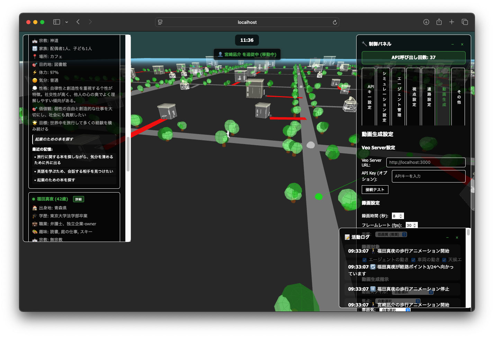

**目的:** シミュレーション結果を高品質な動画として出力します。

**手順:**
1. 「動画生成」ボタンをクリック
2. 動画化したいシーンの範囲を選択
3. 出力設定を調整:
   - 解像度(720p、1080p、4Kなど)
   - フレームレート(30fps、60fpsなど)
   - 動画形式(MP4、MOVなど)
4. 「レンダリング開始」をクリック
5. 処理完了後、動画ファイルをダウンロード

**詳細オプション:**
- カメラパスの設定(自動または手動)
- エフェクトの追加(モーションブラー、被写界深度など)
- 字幕やラベルの表示

**ポイント:**
- レンダリングには時間がかかる場合があります
- 高解像度ほど処理時間が長くなります
- プレビュー機能で事前に確認することをおすすめします

---

## 動画変換の事例

MESAでは、シミュレーション結果をリアルな動画としてレンダリングできます。以下は実際の変換事例です。

### 事例1: 女性が買い物に行く

**シミュレーション概要:**
- エージェントが自宅から店舗まで移動し、買い物をするシナリオ

**オリジナルシミュレーション:**
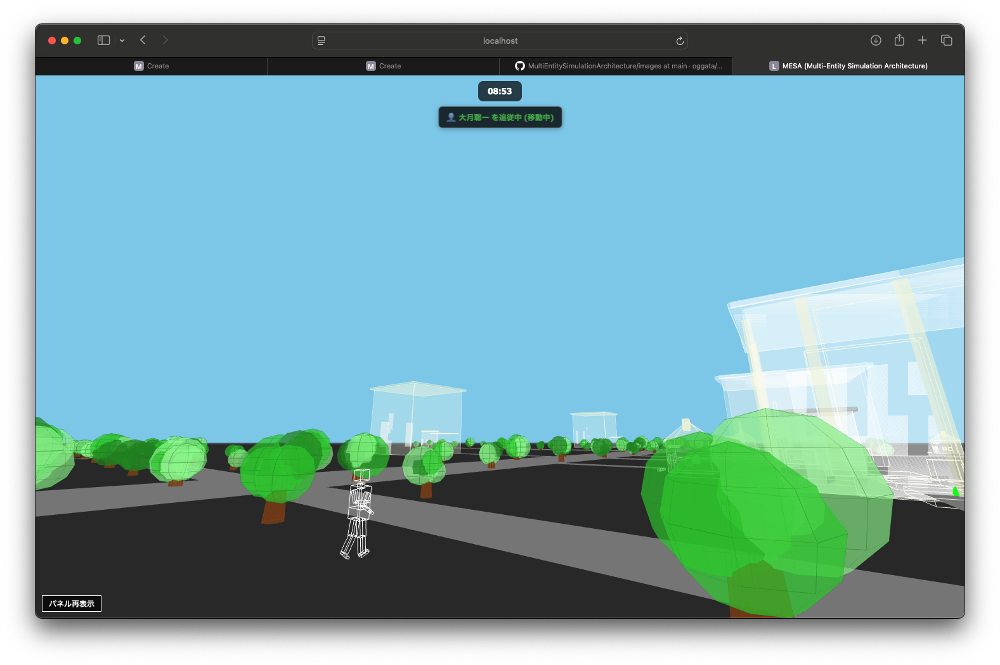
- 3Dマップ上でエージェントの移動経路を表示

**動画変換イメージ:**
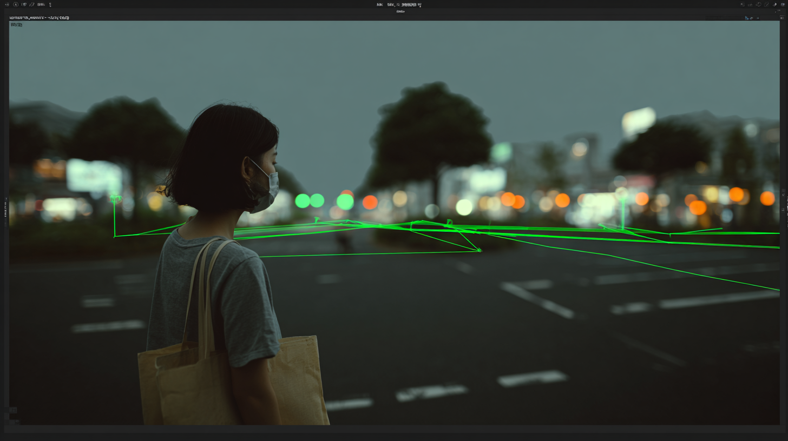
- リアルな街並みとして再現

**生成動画:**

*↑ クリックして動画を再生*

**このシナリオの特徴:**
- 複数の建物や店舗を含む複雑な環境
- エージェントの目的志向的な行動(ナビゲーション)
- 店内での滞在時間や行動パターンも記録

---

### 事例2: 女性がカフェの近くを歩行する

**シミュレーション概要:**
- カフェ周辺の歩行者の自然な動きをシミュレーション

**オリジナルシミュレーション:**
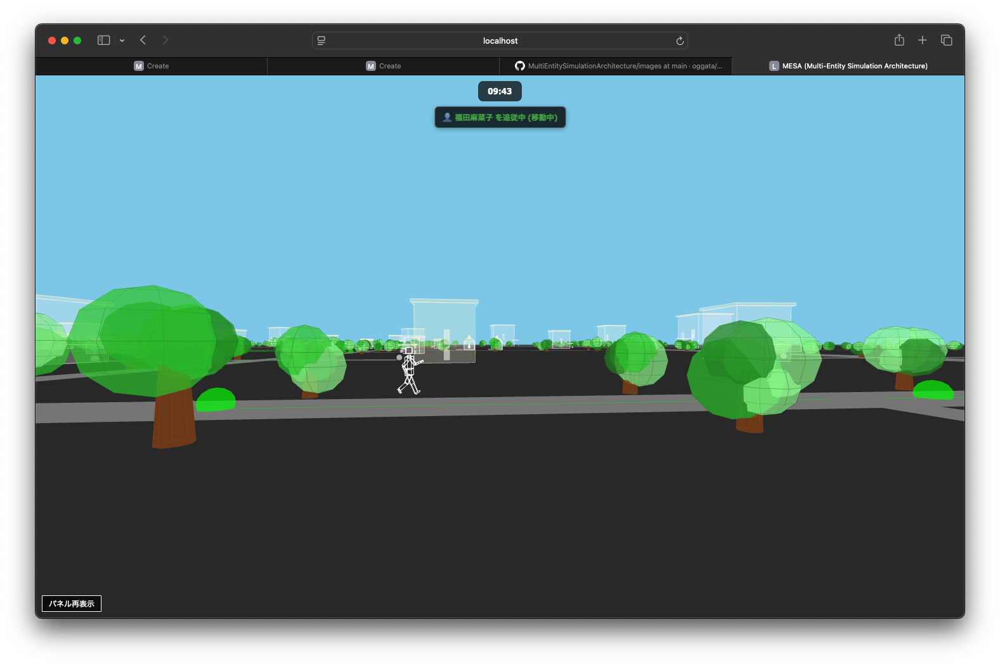

**動画変換イメージ:**
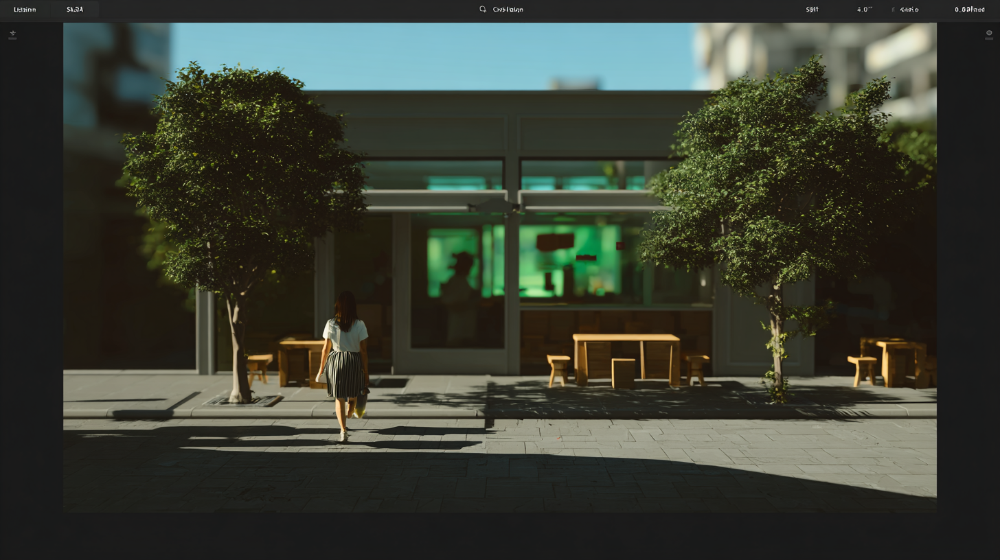

**生成動画:**

*↑ クリックして動画を再生*

**このシナリオの特徴:**
- 自然な歩行速度とリズム
- 周囲の環境への反応(立ち止まり、観察など)
- カフェという特定の場所に基づく行動パターン

---

### 事例3: 女性がカフェの近くを歩行する(別視点)

**シミュレーション概要:**
- 同じカフェ周辺の歩行を異なる視点・時間帯で記録

**オリジナルシミュレーション:**
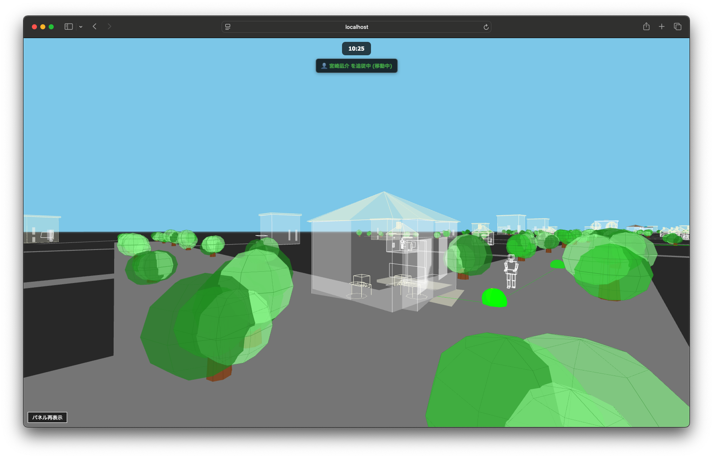

**動画変換イメージ:**
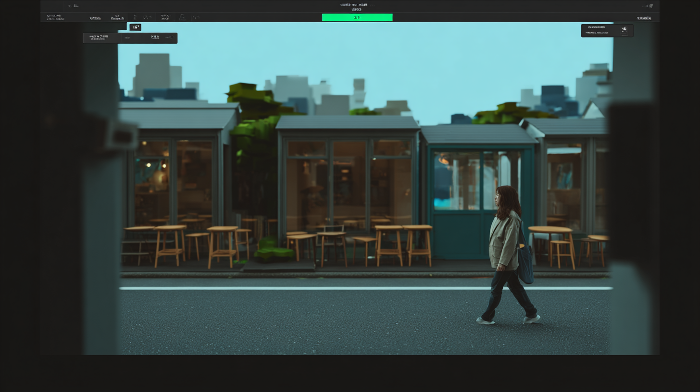

**生成動画:**

[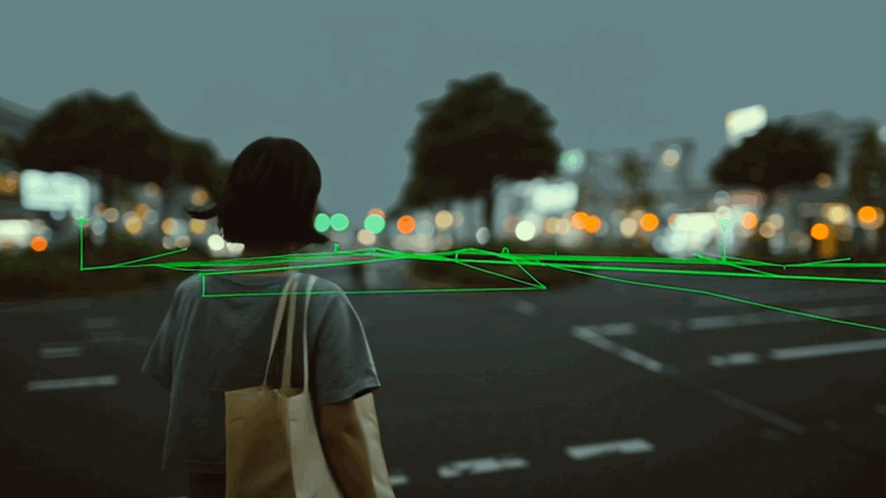](./images/walk2-movie.mp4)

*↑ クリックして動画を再生*

**このシナリオの特徴:**
- カメラアングルの違いによる印象の変化
- 同じエージェントでも時間帯や状況で異なる行動
- 複数の視点からの記録による多角的な分析が可能

---

### 事例4: 男女が会話している

**シミュレーション概要:**
- 2人のエージェントが出会い、自然な会話を展開

**オリジナルシミュレーション:**
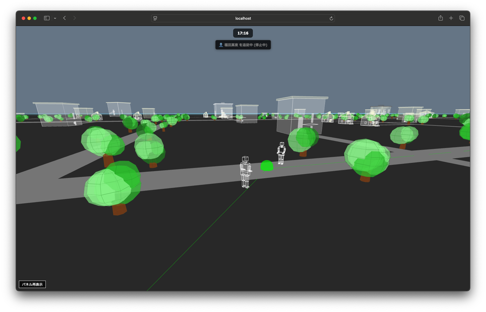

**動画変換イメージ:**
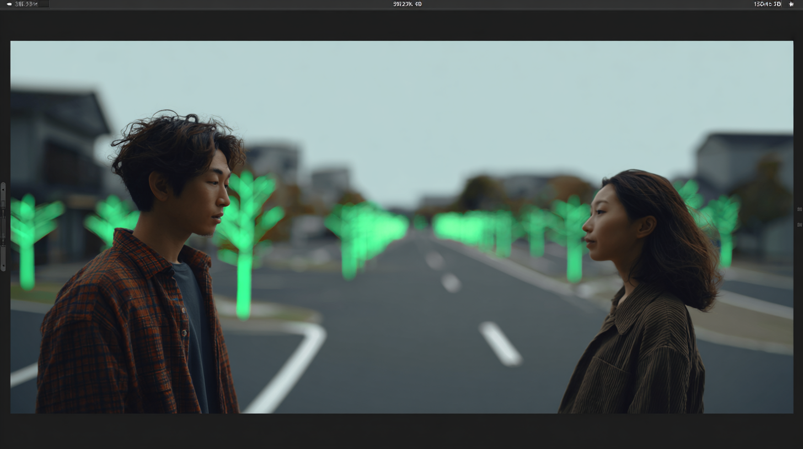

**生成動画:**

[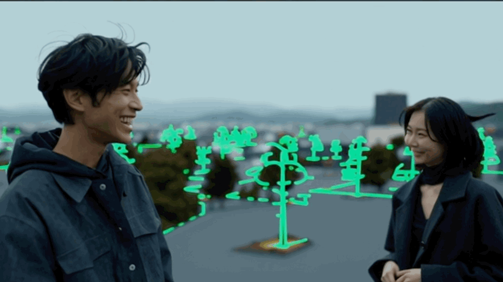](./images/talk-movie.mp4)

*↑ クリックして動画を再生*

**このシナリオの特徴:**
- エージェント間の社会的相互作用
- 自然な身振り手振りやボディランゲージ
- 会話内容に応じた感情表現
- 対話の流れ(挨拶→本題→別れ)の自然な展開

---

## まとめ

MESAを使えば、複雑な人間行動のシミュレーションから高品質な動画生成まで、一連の作業をシームレスに行えます。

**活用シーン:**
- 都市計画や建築設計のシミュレーション
- 人流分析やマーケティングリサーチ
- 教育・トレーニング用コンテンツの作成
- ゲームやアニメーションの制作支援

さらに詳しい情報や高度な機能については、公式ドキュメントをご参照ください。