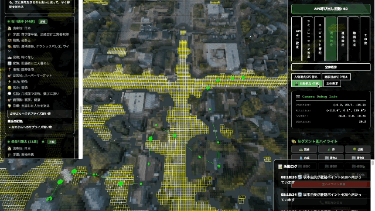

# MESA (Multi-Entity Simulation Architecture)

A 3D autonomous agent simulation that creates virtual cities where AI-powered residents go about their daily lives with realistic behaviors, interactions, and decision-making processes.



[]('https://youtu.be/DKw4uCtytVc?si=9KSZw0GVPqQ83YWE')


## Preparing the Main Software

### For Mac

1. Download mesa-1.0.0-arm64.dmg

https://github.com/oggata/MultiEntitySimulationArchitecture/blob/main/install/mesa-1.0.0-arm64.dmg

2. Install from the dmg file


3. Launch

### Windows and Others (Run in Browser)

1. Download the file
2. Install npm
   ```bash
   npm install
   ```
3. Start a local HTTP server
   ```bash
   python3 -m http.server
   ```
4. Open your browser and navigate to `http://localhost:8000`

### Quick Launch (Launch via External URL in Browser)

Access the URL below. (※ Cannot run Agents in Ollama.)

https://oggata.github.io/MultiEntitySimulationArchitecture/

## Preparing Related Tools

### Installing Ollama

MESA supports Ollama and can be run locally.

1. Download Ollama

```bash
https://ollama.com
```
2. Install and run

```bash
$ ollama pull llama3.2
$ ollama run llama3.2
```

### Creating a Segmentation Map

You can create a simple segmentation map from aerial photos.

#### Using Google Colab

1. Load the following Python script into Google Colab.

https://github.com/oggata/MultiEntitySimulationArchitecture/blob/main/example/colab_3d_city_map.py

2. Import the map data and run the script.


3. The segmentation data (.json) will be created. Place it under src/json/ so it can be loaded from MESA.


#### Using Hugging Face

You can create similar segmentation data by accessing the tool below.

https://huggingface.co/spaces/oggata/map-segment-tool


### Output to Video File

Agent actions are output to a video file.


## Community

Stay updated on the latest development, share ideas, and connect with other users.

[](https://discord.gg/TdENtAnuuX)


## Note

App version update (If the distributed version has errors, please build it yourself and use it)

   ```bash
      //install
      npm install --save-dev electron-builder
      
      //package.jsonを修正

      //build
      npm run build:mac
   ```
