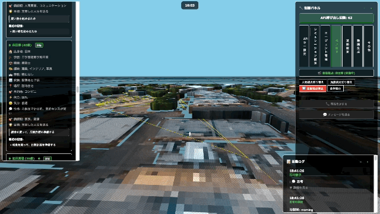
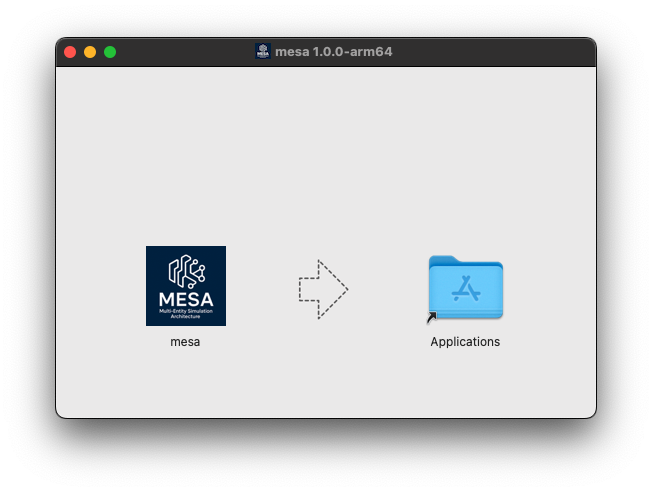
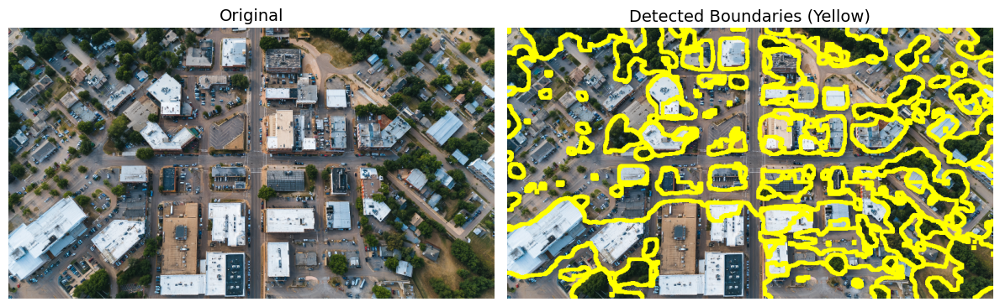
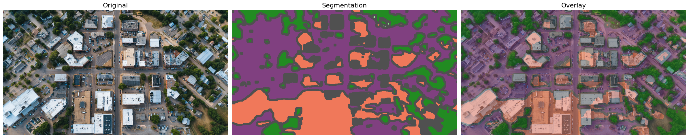
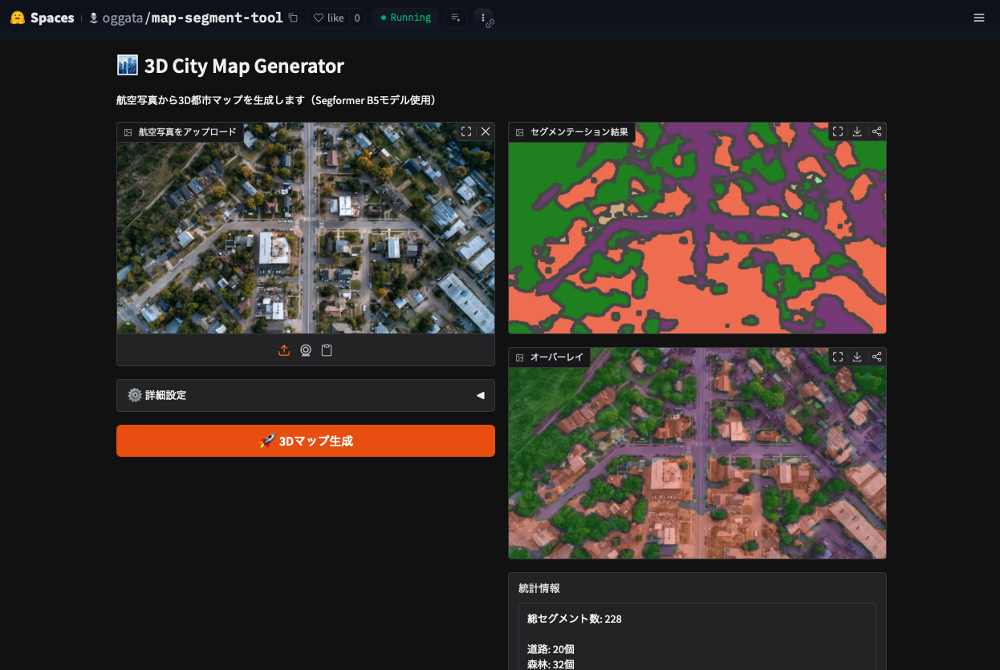
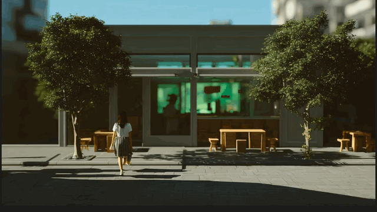

# MESA (Multi-Entity Simulation Architecture)

AI搭載の住民が現実的な行動、相互作用、意思決定プロセスで日常生活を送る仮想都市を作成する3D自律エージェントシミュレーションです。



## 本体の準備

###  Macの場合

1.mesa-1.0.0-arm64.dmgをダウンロード

https://github.com/oggata/MultiEntitySimulationArchitecture/blob/main/install/mesa-1.0.0-arm64.dmg

2.dmgファイルからインストール



3.起動

### Windowsやその他（ブラウザで実行します）

1.ファイルをダウンロード
2.npmをインストール
   ```bash
   npm install
   ```
3.ローカルのhttpサーバーを起動
   ```bash
   python3 -m http.server
   ```
4.ブラウザを開いて `http://localhost:8000` に移動

### 簡単な起動（外部URLをブラウザで起動）

下記のURLへアクセスしてください。(※ OllamaでのAgent実行はできません。)

https://oggata.github.io/MultiEntitySimulationArchitecture/


## 関連ツールの準備

### Ollamaのインストール

MESAはOllamaに対応しており、ローカル環境で実行が可能です。

1.ollamaをダウンロード

```bash
https://ollama.com
```
2.インストールと実行

```bash
$ ollama pull llama3.2
$ ollama run llama3.2
```

### セグメンテーションマップの作成

航空写真から簡易的なセグメンテーションマップを作成できます。

#### GoogleColabを利用する

1.GoogleColabに下記のPythonを読み込みます。

https://github.com/oggata/MultiEntitySimulationArchitecture/blob/main/example/colab_3d_city_map.py

2.地図データをインポートして実行を行います



3.セグメンテーションデータ(.json)が作成されるため、src/json/配下に配置することで、MESAから読み込むことが可能です。



#### Hugging Faceを利用する

下記のツールにアクセスすることで同様のセグメンテーションデータを作成することができます。

https://huggingface.co/spaces/oggata/map-segment-tool




### 動画ファイルへ出力

エージェントの行動は動画ファイルへ出力を行います。




## コミュニティ

最新の開発状況を把握し、アイデアを共有し、他のユーザーとつながるためにコミュニティに参加してください：

[](https://discord.gg/TdENtAnuuX)


